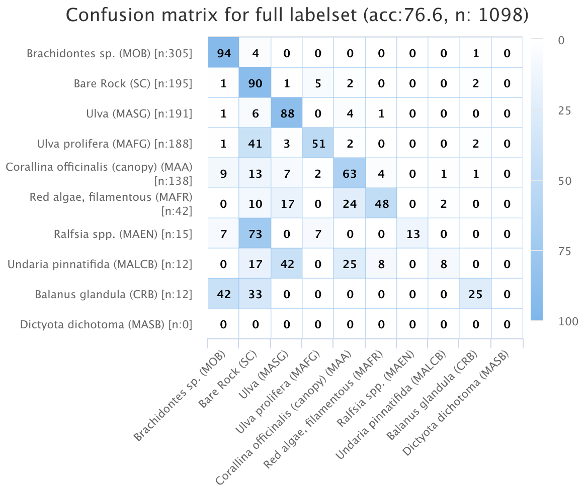

---
output:
  pdf_document: default
  html_document: default
---
```{r, echo=FALSE}
knitr::opts_chunk$set(error = TRUE)
```

---
title: "Deep machine learning applications to monitor marine Essential Biodiversity Variables of rocky shore communities "

header-includes:
- \usepackage{fancyhdr}
- \usepackage{caption}
- \captionsetup[figure]{name=Figure}
- \captionsetup[table]{name=Table}
#- \pagestyle{fancy}
#- \fancyhead[RO]{Capítulo 1}
#- \fancyfoot[CO,CE]{Gonzalo Bravo}
- \fancyfoot[LE,RO]{\thepage}
output: 
  rmarkdown::pdf_document:
    toc: true
    toc_depth: 3
    fig_caption: yes
    extra_dependencies: ["xcolor"]  
    includes:  
      in_header: preamble-latex.tex
---

**G. Bravo**1, **N. Moity**2, **E. Londoño-Cruz**3, **F. E. Muller-Karger**4, **G. Bigatti**1, **E. Montes**4  

1 Instituto de Biología de Organismos Marinos, Consejo Nacional de Investigaciones Científicas y Técnicas, Puerto Madryn, Argentina <br/>

2 Charles Darwin Research Station, Charles Darwin Foundation, Santa Cruz, Galapagos , Ecuador <br/>

3 Departamento de Biología, Universidad del Valle, Cali, Colombia  <br/>

4 College of Marine Science, University of South Florida, St Petersburg, Florida, USA <br/> 

5 Universidad Espíritu Santo, Guayaquil, Ecuador <br/>


# Abtract 

Monitoring marine ecosystems and biodiversity are necessary to understand ecological patterns and processes but also to detect natural or human induced changes such as those resulting from climate change or coastal pollution. A standard technique used in rocky shores is the estimation of cover of sessile organisms and macro-invertebrates. Photoquadrats are becoming standard practice for surveying biodiversity of intertidal and subtidal habitats. They allow to collect large volumes of reliable data efficiently and rapidly in addition to provide a permanent record of the sample. Despite known limitation in taxonomic resolution compared to visual quadrats, photoquadrats have demonstrated to perform well when estimating percent cover of functional groups. Nonetheless, photoquadrat analyses are time consuming and may lead to insufficient accuracy due to low sampling. Cutting-edge machine learning tools are now being used by marine ecologists to annotate species records from photoquadrat imagery. They allow the automatic identification of species, or functional groups, to examine community composition and biodiversity of rocky intertidal and subtidal habitats with high certainty. The use of these tools can significantly reduce the processing time of photo-quadrat imagery and optimize biodiversity survey programs. In this study we present results from visual versus photoquadrat assessments of rocky shores from Argentina, Galapagos Islands (Ecuador) and the Pacific Colombian coast using the CoralNet software. Photo-quadrat imagery was collected during visual surveys carried out at these sites following the South American Research Group on Coastal Ecosystems (SARCE) protocol implemented across the continent by the Marine Biodiversity Observation Network of the Americas (MBON Pole to Pole) program. We apply an ad hoc standardized list of benthic biota and substrata (i.e. CATAMI) as a common label set to enable the comparison between locations. Preliminary results show that CoralNet is able to identify key benthic species and substrate types with high levels of confidence (Pearson correlation coefficient (r) from computer vs visual annotations: Substrate Consolidated, r = 0.91, Molluscs Bivalves, r = 1, Macroalgae filamentous, r = 0.79, Macroalgae sheet-like r = 0.87). We conclude that the CoralNet software can be used to extract presence and percent cover of CATAMI categories. Change detection was tested with an unsupervised configuration of the CoralNet software successfully detecting changes in percent cover of bivalves at 3 sites in Puerto Madryn, Argentina, between Nov/2018 and Nov/2019. This method brings together two programs that are already working to facilitate data analyses over large latitudinal gradients.  We suggest the suitability of this method to establish a protocol to rapidly describe rocky shore biodiversity and to detect changes in the biota in the time frame of the MBON Pole to Pole project along the American continent.<br/>

**Objetives:** Test if unsupervised configuration of the CoralNet software identifies  CATAMI categories on intertidal photoquadrats from 3 sites of Argentina.


# Methods 

The robot was trained with 90 photos (30 per site) with the annotations performed by a experience observator. An independent set of photoquadrats (n=90) from the same sites and date was analyised with CoralNet artificial inteligence. Both results (Human annotator and Robot annotator) were compared with visual quadrats results. The quadrtas analyised visually were the same as the photoquadrats annotated by human.

The same number of CATAMI categories were used for visual and photoquadrats.


# Results 

```{r include=FALSE,cache=TRUE}

library(ggplot2)
library(cowplot)
library(doBy)
library(reshape)
library(dplyr)
library(plotly)
library(ggpubr)


#read data
photo.cover <- read.csv("MBON_Argentina_percent_covers.csv")
photo.metadata <- read.csv("MBON_Argentina_metadata.csv")

#merge photo.metadata and photo.cover
photo<- merge(photo.metadata,photo.cover, by = "Name", all.x = TRUE) 

#Visual data 
visual <- read.csv("percent_cover_visual_2018.csv") 

#Joint the two dataframes
photo_visual <- rbind(photo, visual)

#Change names of Annotation Status (types of analysis)
photo_visual$Annotation.status <- as.factor(photo_visual$Annotation.status)
levels(photo_visual$Annotation.status) <-  c("Photoquadrat Human", "Photoquadrat Robot","Visual quadrat")

#Create long type matrix 
library(reshape)
photo_visual_long = melt(photo_visual, id.vars = 1:20, measure.vars = 21:ncol(photo_visual), variable_name = "CATAMI", value_name ="cover", na.rm = T)


#Calculate mean, SD, SE for cover data by factors (species=Shortname,site, strata,) 
library(doBy)
Coverdata <- summaryBy(value ~ CATAMI + site + strata + Annotation.status,data=photo_visual_long, FUN = function(x) { c(mean = mean(x),SD=sd(x),SE = sqrt(var(x)/length(x)))})

# Subset more abundant 
#MOB, MAFG,MAFR, MASG, SC, MAA, 
Coverdata_abundant <- subset(Coverdata,CATAMI=="MOB"|CATAMI=="MAFG"|CATAMI=="MASG"|CATAMI=="MAFR"|CATAMI=="MAFG"|CATAMI=="SC"|CATAMI=="MAA")
```

## Robot performance 

```{r pressure, echo=FALSE, fig.cap="Confusion Matrix", out.width = '80%'}

```


## Univariate results

```{r,fig.cap='% cover by type of analysis and sites',eval=TRUE,echo=FALSE,fig.width=8,fig.height=8,warning=FALSE}
ggplot(Coverdata_abundant,aes(x=strata,y=value.mean,fill=CATAMI)) + geom_bar(alpha=0.7,stat="identity",color="black",position=position_dodge()) + scale_color_grey() + geom_errorbar(aes(ymin=value.mean-value.SE, ymax=value.mean+value.SE), width=.2,position=position_dodge(.9)) + theme_bw() + scale_y_continuous(limits = c(0,100))+ scale_x_discrete(limits=c("HIGHTIDE","MIDTIDE","LOWTIDE"),labels=c("HIGHT","MID","LOW"))+ labs(fill = "CATAMI CODE",x = "", y = "Cover (%)", title = "",caption ="Mean + SE") + scale_fill_brewer(palette="Greys")+ facet_grid(site~Annotation.status) + theme(legend.position = "bottom",panel.grid.major = element_blank(),panel.grid.minor = element_blank())
```

```{r,fig.cap='% cover by type of analysis',eval=TRUE,echo=FALSE,fig.width=8,fig.height=8,warning=FALSE}
ggplot(Coverdata_abundant,aes(x=strata,y=value.mean,fill=Annotation.status)) + geom_bar(alpha=0.7,stat="identity",color="black",position=position_dodge()) + scale_color_grey() + geom_errorbar(aes(ymin=value.mean-value.SE, ymax=value.mean+value.SE), width=.2,position=position_dodge(.9)) + theme_bw() + scale_y_continuous(limits = c(0,100))+ scale_x_discrete(limits=c("HIGHTIDE","MIDTIDE","LOWTIDE"),labels=c("HIGHT","MID","LOW")) + facet_grid(site~CATAMI) + labs(fill = "Method",x = "", y = "Cover (%)", title = "",caption ="Mean + SE") + theme(legend.position = "bottom",panel.grid.major = element_blank(),panel.grid.minor = element_blank()) +scale_fill_brewer(palette="Greys",name = "Method")
```
