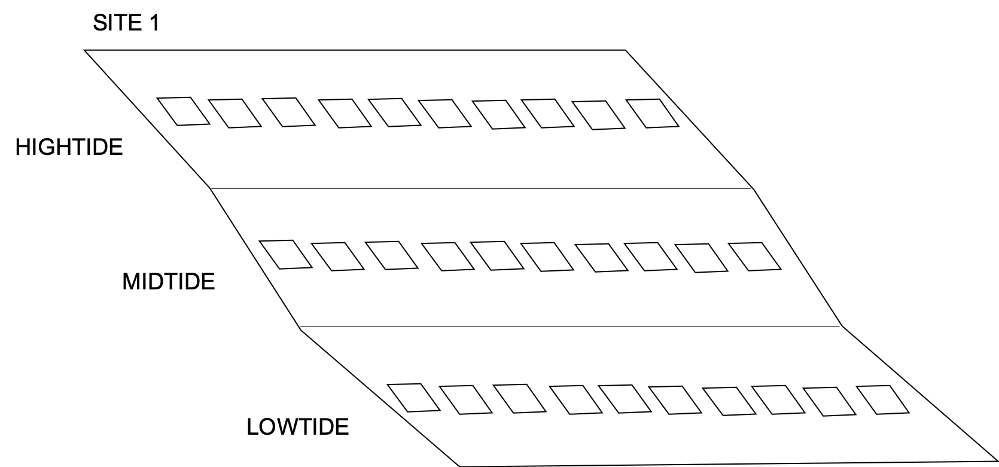
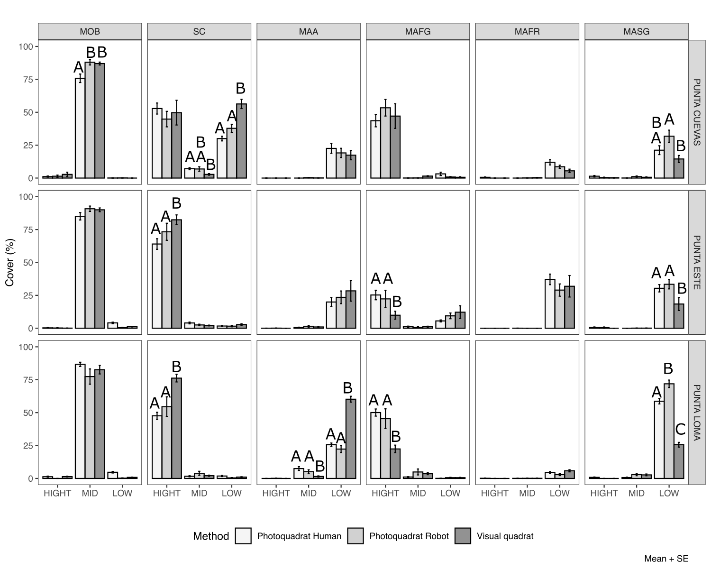

---
output:
  pdf_document: default
  html_document: default
---
```{r, echo=FALSE}
knitr::opts_chunk$set(error = TRUE)
```

---
title: "Machine learning applications to monitor marine Essential Biodiversity Variables of rocky shore communities "

header-includes:
- \usepackage{fancyhdr}
- \usepackage{caption}
- \captionsetup[figure]{name=Figure}
- \captionsetup[table]{name=Table}
#- \pagestyle{fancy}
#- \fancyhead[RO]{Capítulo 1}
#- \fancyfoot[CO,CE]{Gonzalo Bravo}
- \fancyfoot[LE,RO]{\thepage}
output: 
  rmarkdown::pdf_document:
    toc: true
    toc_depth: 3
    fig_caption: yes
    extra_dependencies: ["xcolor"]  
    includes:  
      in_header: preamble-latex.tex
---

**G. Bravo** 1, **N. Moity** 2, **E. Londoño-Cruz** 3, **F. E. Muller-Karger** 4, **G. Bigatti** 1, 5 , **E. Montes** 4  

1 Instituto de Biología de Organismos Marinos, Consejo Nacional de Investigaciones Científicas y Técnicas, Puerto Madryn, Argentina <br/>

2 Charles Darwin Research Station, Charles Darwin Foundation, Santa Cruz, Galapagos , Ecuador <br/>

3 Departamento de Biología, Universidad del Valle, Cali, Colombia  <br/>

4 College of Marine Science, University of South Florida, St Petersburg, Florida, USA <br/> 

5 Universidad Espíritu Santo, Guayaquil, Ecuador <br/>


# Abstract 

Monitoring marine ecosystems and biodiversity are necessary to understand ecological patterns and processes but also to detect natural or human induced changes such as those resulting from climate change or coastal pollution. A standard technique used in rocky shores is the estimation of cover of sessile organisms and macro-invertebrates. Photoquadrats are becoming standard practice for surveying biodiversity of intertidal and subtidal habitats. They allow to collect large volumes of reliable data efficiently and rapidly in addition to provide a permanent record of the sample. Despite known limitation in taxonomic resolution compared to visual quadrats, photoquadrats have demonstrated to perform well when estimating percent cover of functional groups. Nonetheless, photoquadrat analyses are time consuming and may lead to insufficient accuracy due to low sampling. Cutting-edge machine learning tools are now being used by marine ecologists to annotate species records from photoquadrat imagery. They allow the automatic identification of species, or functional groups, to examine community composition and biodiversity of rocky intertidal and subtidal habitats with high certainty. The use of these tools can significantly reduce the processing time of photo-quadrat imagery and optimize biodiversity survey programs. In this study we present results from visual versus photoquadrat assessments of rocky shores from Argentina, Galapagos Islands (Ecuador) and the Pacific Colombian coast using the CoralNet software. Photo-quadrat imagery was collected during visual surveys carried out at these sites following the South American Research Group on Coastal Ecosystems (SARCE) protocol implemented across the continent by the Marine Biodiversity Observation Network of the Americas (MBON Pole to Pole) program. We apply an ad hoc standardized list of benthic biota and substrata (i.e. CATAMI) as a common label set to enable the comparison between locations. Preliminary results show that CoralNet is able to identify key benthic species and substrate types with high levels of confidence (Pearson correlation coefficient (r) from computer vs visual annotations: Substrate Consolidated, r = 0.91, Molluscs Bivalves, r = 1, Macroalgae filamentous, r = 0.79, Macroalgae sheet-like r = 0.87). We conclude that the CoralNet software can be used to extract presence and percent cover of CATAMI categories. Change detection was tested with an unsupervised configuration of the CoralNet software successfully detecting changes in percent cover of bivalves at 3 sites in Puerto Madryn, Argentina, between Nov/2018 and Nov/2019. This method brings together two programs that are already working to facilitate data analyses over large latitudinal gradients.  We suggest the suitability of this method to establish a protocol to rapidly describe rocky shore biodiversity and to detect changes in the biota in the time frame of the MBON Pole to Pole project along the American continent.<br/>

# Objetives
- Test unsupervised configuration of the CoralNet software to identify CATAMI categories on intertidal photoquadrats from sampling sites of MBON.
- Provide a fast method to detect changes on intertidal habitats, using photoquadrats analysided by artificial intelligence (AI).

# Methods 
Here we present the firts results using photoquadrats from Argentina

The robot was trained with 151 photos (50 x 50 cm quadrat) with  100 annotations per photo performed by an experienced observator (Human annotator). 

An independent set of photoquadrats (n=90) from the same sites and dates was analyised with CoralNet AI. Both results (Human annotator and Robot annotator) were compared with visual quadrats results. The quadrsts analyised visually were the same as the photoquadrats annotated by the CoralNet Robot.


Sampling Protocol for each site:
```{r protocol, echo=FALSE, fig.cap=" 10 phtoquadrats per strata", warning=FALSE, out.width='100%',fig.show='asis'}

```

In Argentina ~50 extra photos were taken on each site, allowing to train the CoralNet robot with different photos from those analysed viasually. If there arent  extra photos, the robot can be trained with the same photos but using alleatory points insted (working progress).

\pagebreak

We decide to use CATAMI codes insted of species to unify among different countries. 

The same number of CATAMI categories were used for visual and photoquadrats:
```{r include=FALSE}
library(ggplot2)
library(cowplot)
library(doBy)
library(reshape)
library(dplyr)
library(plotly)
library(ggpubr)
library(vegan)

#Set the working directory to the folder "Source_Argentina"
#read data
#read data
photo.cover <- read.csv("MBON_Argentina_percent_covers_2018.csv")
photo.metadata <- read.csv("MBON_Argentina_metadata_2018.csv")

#merge photo.metadata and photo.cover
photo<- merge(photo.metadata,photo.cover, by = "Name", all.x = TRUE) 

#Visual data 
visual <- read.csv("MBON_Argentina_percent_cover_visual_2018.csv") 

#Joint the two dataframes
photo_visual <- rbind(photo, visual)

#Change names of Annotation Status (types of analysis)
photo_visual$Annotation.status <- as.factor(photo_visual$Annotation.status)
levels(photo_visual$Annotation.status) <-  c("Photoquadrat Human", "Photoquadrat Robot","Visual quadrat")

#Create long type matrix 
library(reshape)
photo_visual_long = melt(photo_visual, id.vars = 1:20, measure.vars = 21:ncol(photo_visual), variable_name = "CATAMI", value_name ="cover", na.rm = T)


#Calculate mean, SD, SE for cover data by factors (species=Shortname,site, strata,) 
library(doBy)
Coverdata <- summaryBy(value ~ CATAMI + site + strata + Annotation.status,data=photo_visual_long, FUN = function(x) { c(mean = mean(x),SD=sd(x),SE = sqrt(var(x)/length(x)))})

# Subset more abundant 
#MOB, MAFG,MAFR, MASG, SC, MAA, 
Coverdata_abundant <- subset(Coverdata,CATAMI=="MOB"|CATAMI=="MAFG"|CATAMI=="MASG"|CATAMI=="MAFR"|CATAMI=="MAFG"|CATAMI=="SC"|CATAMI=="MAA")

tableobservations <- summaryBy(value ~ CATAMI,data=photo_visual_long, FUN = function(x) {sum(x)})
names(tableobservations) <- c("CATAMI CODE", "Frequency")
tableobservations <- tableobservations[order(-tableobservations$Frequency),]

#read labelset MBON
labelset <- read.csv("labelset_MBON.csv")

#correlation matrix
correlations <- read.csv("correation_matrix_visualVSrobot.csv",stringsAsFactors=T)
```

```{r CATAMI list, echo=FALSE, message=FALSE, warning=FALSE}
knitr::kable(tableobservations)
```

```{r CATAMIlistdefinition, echo=FALSE, message=FALSE, warning=FALSE}
knitr::kable(labelset)
```

\pagebreak

# Results 

```{r,fig.cap='Overall view of differences between methods',eval=TRUE,echo=FALSE,fig.width=8,fig.height=8,warning=FALSE,fig.show='asis'}
ggplot(Coverdata_abundant,aes(x=strata,y=value.mean,fill=CATAMI)) + geom_bar(alpha=0.7,stat="identity",color="black",position=position_dodge()) + scale_color_grey() + geom_errorbar(aes(ymin=value.mean-value.SE, ymax=value.mean+value.SE), width=.2,position=position_dodge(.9)) + theme_bw() + scale_y_continuous(limits = c(0,100))+ scale_x_discrete(limits=c("HIGHTIDE","MIDTIDE","LOWTIDE"),labels=c("HIGH","MID","LOW"))+ labs(fill = "CATAMI CODE",x = "", y = "Cover (%)", title = "",caption ="Mean + SE") + scale_fill_brewer(palette="Greys")+ facet_grid(site~Annotation.status) + theme(legend.position = "bottom",panel.grid.major = element_blank(),panel.grid.minor = element_blank())
```

```{r echo=FALSE, fig.cap="Diferences among method for percentage cover estimation of mayor CATAMI categories. Different letters indicate p<0.05 (Mann-Whitney test)", warning=FALSE, out.width='100%',fig.show='asis'}

```


```{r include=FALSE}
#Correlations
correlations$algae <- as.numeric(paste(correlations$MAA+correlations$MAEN+correlations$MAENRC+correlations$MAFG+correlations$MAFR+correlations$MAG+correlations$MALCB+correlations$MASB+correlations$MASG))

correlations$algae.A <- as.numeric(paste(correlations$MAA.A+correlations$MAEN.A+correlations$MAENRC.A+correlations$MAFG.A+correlations$MAFR.A+correlations$MAG.A+correlations$MALCB.A+correlations$MASB.A+correlations$MASG.A))

SC <- ggscatter(correlations, x = "SC", y = "SC.A", add = "reg.line",conf.int=T) +
  labs(title="Substrate", y="CoralNet",x="Visual")+ ylim(0,100)+ xlim(0,100)+
  stat_cor(label.x = 3, label.y = 100) 

MOB <- ggscatter(correlations, x = "MOB", y = "MOB.A", add = "reg.line",conf.int=T) +
  labs(title="Molluscs: Bivalves", y="CoralNet",x="Visual")+ ylim(0,100)+ xlim(0,100)+
  stat_cor(label.x = 3, label.y = 100) 

MAFG<- ggscatter(correlations, x = "MAFG", y = "MAFG.A", add = "reg.line",conf.int=T) +
  labs(title="Macroalgae:filamentous Green", y="CoralNet",x="Visual")+ ylim(0,100)+ xlim(0,100)+
  stat_cor(label.x = 3, label.y = 100) 

MAFR <- ggscatter(correlations, x = "MAFR", y = "MAFR.A", add = "reg.line",conf.int=T) +
  labs(title="Macroalgae:filamentous Red", y="CoralNet",x="Visual")+ ylim(0,100)+ xlim(0,100)+
  stat_cor(label.x = 3, label.y = 100) 

MASG <- ggscatter(correlations, x = "MASG", y = "MASG.A", add = "reg.line",conf.int=T) +
  labs(title="Macroalgae:sheet-like Green", y="CoralNet",x="Visual")+ ylim(0,100)+ xlim(0,100)+
  stat_cor(label.x = 3, label.y = 100) 

MAA <- ggscatter(correlations, x = "MAA", y = "MAA.A", add = "reg.line",conf.int=T) +
  labs(title="Macroalgae:Articulated calcareous", y="CoralNet",x="Visual")+ ylim(0,100)+ xlim(0,100)+
  stat_cor(label.x = 3, label.y = 100) 

Algae <- ggscatter(correlations, x = "algae", y = "algae.A", add = "reg.line",conf.int=T) +
  labs(title="Algae Total", y="CoralNet",x="Visual")+ ylim(0,100)+ xlim(0,100)+
  stat_cor(label.x = 3, label.y = 100) 

MAEN <- ggscatter(correlations, x = "MAEN", y = "MAEN.A", add = "reg.line",conf.int=T) +
  labs(title="Encrusting Algae", y="CoralNet",x="Visual")+ ylim(0,25)+ xlim(0,25)+
  stat_cor(label.x = 3, label.y =25) 
```


```{r, fig.height=10, fig.width=8, message=FALSE, warning=FALSE,echo=FALSE,fig.cap='Correlations between CoralNet robot and visual estimations',fig.show='asis'}
library(cowplot)
plot_grid(SC,MOB,MAFG,MAFR,MASG,MAA,MAEN,Algae,ncol = 2, align = "v")

```


```{r MDS,include=FALSE}
#MDS by strata
photo_visual.Site <- photo_visual
#create a list with dataframe of strata 
l<-list(subset(photo_visual.Site,strata=="HIGHTIDE"),subset(photo_visual.Site,strata=="MIDTIDE"),subset(photo_visual.Site,strata=="LOWTIDE"))

#nMDS plot
nMDSbystrata <- lapply(l, function (j) { NMDS=metaMDS(sqrt(sqrt(j[,-(1:20)])),k=2,trymax=10,try = 10,distance ="bray",autotransform = FALSE)
NMDS1 <-NMDS$points[,1] 
NMDS2 <- NMDS$points[,2]
MDS.plot<-cbind(j[,-(1:20)], NMDS1, NMDS2,j$Annotation.status) 
ggplot(MDS.plot, aes(NMDS1, NMDS2, color=j$Annotation.status,shape=j$Annotation.status))+geom_point(position=position_jitter(.1),size=3)+stat_ellipse(type='t',size =2) +theme_bw() + theme(legend.position = "none",axis.text.x = element_blank(),axis.text.y = element_blank(), axis.ticks = element_blank(), axis.title.x = element_blank(), axis.title.y = element_blank(),panel.background = element_blank(), panel.grid.major = element_blank(),panel.grid.minor = element_blank(),plot.background = element_blank()) + annotate("text", x=max(NMDS1)-0.5, y=min(NMDS2)-0.5, label=paste('Stress =',round(NMDS$stress,3)))+ggtitle("") + theme(legend.key.size = unit(4,"line")) + scale_color_grey(name = "Analysis")+ scale_shape_manual(name = "Analysis",values = c(16,17,15,3))+ggtitle(unique(j$strata))
})

#Plot for legend 
nMDSlegend=metaMDS(photo_visual.Site[,-(1:20)],k=2,trymax=10,try = 10,distance ="bray",autotransform = FALSE)
NMDS1.legend <-nMDSlegend$points[,1] 
NMDS2.legend <- nMDSlegend$points[,2]
MDS.plot.legend<-cbind(photo_visual.Site[,-(1:20)], NMDS1.legend, NMDS2.legend,photo_visual.Site$strata) 
legend <- ggplot(MDS.plot.legend, aes(NMDS1.legend, NMDS2.legend, color=photo_visual.Site$Annotation.status,shape=photo_visual.Site$Annotation.status))+geom_point(position=position_jitter(.1),size=3)+stat_ellipse(type='t',size =2) +theme_bw() + theme(legend.position = "bottom",axis.text.x = element_blank(),axis.text.y = element_blank(), axis.ticks = element_blank(), axis.title.x = element_blank(), axis.title.y = element_blank(),panel.background = element_blank(), panel.grid.major = element_blank(),panel.grid.minor = element_blank(),plot.background = element_blank())+ theme(legend.key.size = unit(4,"line")) + scale_color_grey(name = "")+ scale_shape_manual(name = "",values = c(16,17,15,3))

#Create plot grid and save
library(cowplot)
legend_plot <- get_legend(legend)#take legend
plotnMDS <- plot_grid(nMDSbystrata[[1]],nMDSbystrata[[2]],nMDSbystrata[[3]],ncol = 1, align = "v")
plotnMDS_legend <- plot_grid(plotnMDS, legend_plot, ncol = 1, rel_heights = c(1,.1))

#PERMANOVA without transformation
PERMANOVAbystrata_NOtransformed <- lapply(l, function (j) { 
  library(pairwiseAdonis)
  #data no transformed
  pairwise.adonis(j[,-(1:20)],j$Annotation.status,sim.method ="bray")
})
```

```{r,echo=FALSE, fig.cap ='nMDS for all sites together',fig.height=8, fig.show='asis', fig.width=7, message=FALSE, warning=FALSE,eval=TRUE}
plot_grid(plotnMDS, legend_plot, ncol = 1, rel_heights = c(1,.2))
```
\pagebreak

```{r PERMANOVA1, echo=FALSE, message=FALSE, warning=FALSE}
knitr::kable(PERMANOVAbystrata_NOtransformed[[1]],caption = "PERMANOVA Hightide")
```

```{r PERMANOVA2, echo=FALSE, message=FALSE, warning=FALSE}
knitr::kable(PERMANOVAbystrata_NOtransformed[[2]],caption = "PERMANOVA Midtide")
```

```{r PERMANOVA3, echo=FALSE, message=FALSE, warning=FALSE}
knitr::kable(PERMANOVAbystrata_NOtransformed[[3]],caption = "PERMANOVA Lowtide")
```


\pagebreak


# Code and data files 
All the codes and data files are in github

https://github.com/gonzalobravoargentina/CoralNet_MBON


